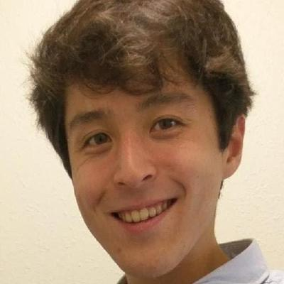

= About
:date: 2023-06-01
:modified: 2025-03-09
:summary: Luke Gessler

I am an assistant professor at https://linguistics.indiana.edu/index.html[Indiana University's Department of Linguistics], with adjunct appointments in https://cs.indiana.edu/index.html[CS], https://cogs.indiana.edu/index.html[CogSci], and https://melc.indiana.edu/[MELC].
Previously, I was a postdoc in the https://nala-cub.github.io/[NALA Group] at CU Boulder, and I got my Ph.D. in computational linguistics at https://linguistics.georgetown.edu[Georgetown University] with the https://gucorpling.org/corpling/[Corpling lab] and https://nert.georgetown.edu/[NERT].
I am interested in low-resource NLP and language resource development, particularly in the context of endangered language documentation.
